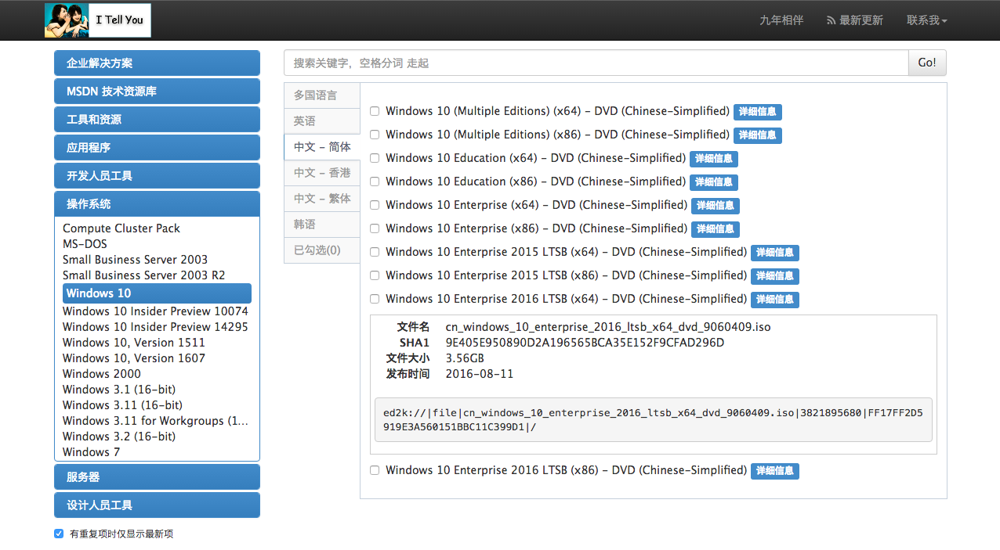
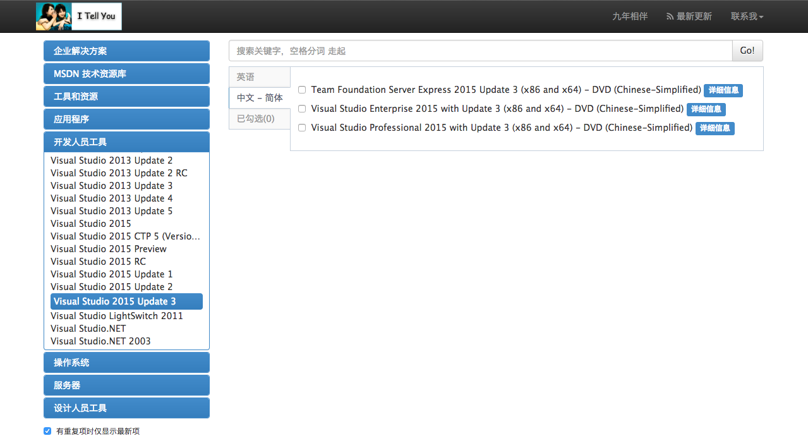
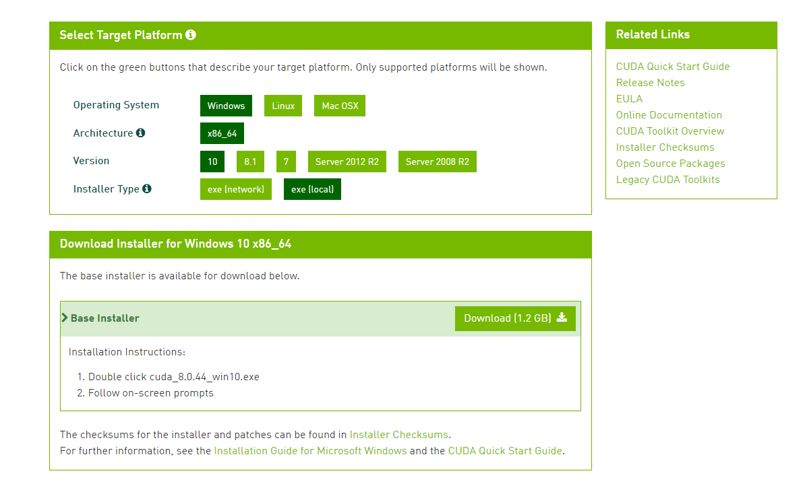

*這裡需要說明一下，筆者**不建議在Windows環境下進行深度學習的研究**，一方面是因為Windows所對應的框架搭建的依賴過多，社區設定不完全；另一方面，Linux系統下對顯卡支持、內存釋放以及存儲空間調整等硬件功能支持較好。如果您對Linux環境感到陌生，並且大多數開發環境在Windows下更方便操作的話，希望這篇文章對您會有幫助。 *


**由於Keras默認以Tensorflow為後端，且Theano後端更新緩慢，本文默認採用Tensorflow1.0作為Keras後端，Theano版安裝方式請訪問[www.scp-173.top**](http:/ /www.scp-173.top)

---
# 關於計算機的硬件配置說明
## **推薦配置**
如果您是高校學生或者高級研究人員，並且實驗室或者個人資金充沛，建議您採用如下配置：

 - 主板：X299型號或Z270型號
 - CPU: i7-6950X或i7-7700K 及其以上高級型號
 - 內存：品牌內存，總容量32G以上，根據主板組成4通道或8通道
 - SSD： 品牌固態硬盤，容量256G以上
 - <font color=#FF0000>顯卡：NVIDIA GTX TITAN(XP) NVIDIA GTX 1080ti、NVIDIA GTX TITAN、NVIDIA GTX 1080、NVIDIA GTX 1070、NVIDIA GTX 1060 (順序為優先建議，並且建議同一顯卡，可以根據主板插槽數量購買多塊，例如X299型號主板最多可以採用×4的顯卡)</font>
 - 電源：由主機機容量的確定，一般有顯卡總容量後再加200W即可
## **最低配置**
如果您是僅僅用於自學或代碼調試，亦或是條件所限僅採用自己現有的設備進行開發，那麼您的電腦至少滿足以下幾點：

 - CPU：Intel第三代i5和i7以上系列產品或同性能AMD公司產品
 - 內存：總容量4G以上

## <font color=#FF0000>CPU說明</font>
 - 大多數CPU目前支持多核多線程，那麼如果您採用CPU加速，就可以使用多線程運算。這方面的優勢對於服務器CPU志強系列尤為關鍵
## <font color=#FF0000>顯卡說明</font>
 - 如果您的顯卡是非NVIDIA公司的產品或是NVIDIA GTX系列中型號的第一個數字低於6或NVIDIA的GT系列，都不建議您採用此類顯卡進行加速計算，例如`NVIDIA GT 910`、 `NVIDIA GTX 460` 等等。
 - 如果您的顯卡為筆記本上的GTX移動顯卡（型號後面帶有標識M），那麼請您慎重使用顯卡加速，因為移動版GPU容易發生過熱燒毀現象。
 - 如果您的顯卡，顯示的是諸如 `HD5000`,`ATI 5650` 等類型的顯卡，那麼您只能使用CPU加速
 - 如果您的顯卡芯片為Pascal架構（`NVIDIA GTX 1080`,`NVIDIA GTX 1070`等），您只能在之後的配置中選擇`CUDA 8.0`
 ---

# 基本開發環境搭建
## 1. Microsoft Windows 版本
關於Windows的版本選擇，本人強烈建議對於部分高性能的新機器採用`Windows 10`作為基礎環境，部分老舊筆記本或低性能機器採用`Windows 7`即可，本文環境將以`Windows 10`作為開發環境進行描述。對於Windows 10的發行版本選擇，筆者建議採用`Windows_10_enterprise_2016_ltsb_x64`作為基礎環境。

這裡推薦到[<font color=#FF0000>MSDN我告訴你</font>](http://msdn.itellyou.cn/)下載，也感謝作者國內優秀作者[雪龍狼前輩](http:/ /weibo.com/207156000?is_hot=1)所做出的貢獻與犧牲。



直接貼出熱鏈，複製粘貼迅雷下載：

    ed2k://|file|cn_windows_10_enterprise_2016_ltsb_x64_dvd_9060409.iso|3821895680|FF17FF2D5919E3A560151BBC11C399D1|/


## 2. 編譯環境Microsoft Visual Studio 2015 Update 3
*<font color=#FF0000>(安裝CPU版本非必須安裝)</font>*

CUDA編譯器為Microsoft Visual Studio，版本從2010-2015，`cuda8.0`僅支持2015版本，暫不支持VS2017，本文采用`Visual Studio 2015 Update 3`。
同樣直接貼出迅雷熱鏈：

    ed2k://|file|cn_visual_studio_professional_2015_with_update_3_x86_x64_dvd_8923256.iso|7745202176|DD35D3D169D553224BE5FB44E074ED5E|/
 

## 3. Python環境
python環境建設推薦使用科學計算集成python發行版**Anaconda**，Anaconda是Python眾多發行版中非常適用於科學計算的版本，裡面已經集成了很多優秀的科學計算Python庫。
建議安裝`Anconda3 4.2.0`版本，目前新出的python3.6存在部分不兼容問題，所以建議安裝歷史版本4.2.0
**注意：windows版本下的tensorflow暫時不支持python2.7**

下載地址： [<font color=#FF0000>Anaconda</font>](https://repo.continuum.io/archive/index.html)


## 4. CUDA
*<font color=#FF0000>(安裝CPU版本非必須安裝)</font>*
CUDA Toolkit是NVIDIA公司面向GPU編程提供的基礎工具包，也是驅動顯卡計算的核心技術工具。
直接安裝CUDA8.0即可
下載地址：[https://developer.nvidia.com/cuda-downloads](https://developer.nvidia.com/cuda-downloads)

在下載之後，按照步驟安裝，**不建議新手修改安裝目錄**，同上，環境不需要配置，安裝程序會自動配置好。

## 6. 加速庫CuDNN
從官網下載需要註冊 Nvidia 開發者賬號，網盤搜索一般也能找到。
Windows目前最新版v6.0，但是keras尚未支持此版本，請下載v5.1版本，即 cudnn-8.0-win-x64-v5.1.zip。
下載解壓出來是名為cuda的文件夾，裡面有bin、include、lib，將三個文件夾複製到安裝CUDA的地方覆蓋對應文件夾，默認文件夾在：`C:\Program Files\NVIDIA GPU Computing Toolkit\CUDA\8.0`

---

# Keras 框架搭建
## 安裝

在CMD命令行或者Powershell中輸入：
``` powershell
# GPU 版本
>>> pip install --upgrade tensorflow-gpu

# CPU 版本
>>> pip install --upgrade tensorflow

# Keras 安裝
>>> pip install keras -U --pre
```

之後可以驗證keras是否安裝成功,在命令行中輸入Python命令進入Python變成命令行環境：
```python
>>> import keras

Using Tensorflow backend.
I c:\tf_jenkins\home\workspace\release-win\device\gpu\os\windows\tensorflow\stream_executor\dso_loader.cc:135] successfully opened CUDA library cublas64_80.dll locally
I c:\tf_jenkins\home\workspace\release-win\device\gpu\os\windows\tensorflow\stream_executor\dso_loader.cc:135] successfully opened CUDA library cudnn64_5.dll locally
I c:\tf_jenkins\home\workspace\release-win\device\gpu\os\windows\tensorflow\stream_executor\dso_loader.cc:135] successfully opened CUDA library cufft64_80.dll locally
I c:\tf_jenkins\home\workspace\release-win\device\gpu\os\windows\tensorflow\stream_executor\dso_loader.cc:135] successfully opened CUDA library nvcuda.dll locally
I c:\tf_jenkins\home\workspace\release-win\device\gpu\os\windows\tensorflow\stream_executor\dso_loader.cc:135] successfully opened CUDA library curand64_80.dll locally

>>>
```
沒有報錯，那麼Keras就已經**成功安裝**了


 - Keras中mnist數據集測試
 下載Keras開發包
```
>>> conda install git
>>> git clone https://github.com/fchollet/keras.git
>>> cd keras/examples/
>>> python mnist_mlp.py
```
程序無錯進行，至此，keras安裝完成。

[<font color='#FF0000'>Keras中文文檔地址</font>](http://keras-cn.readthedocs.io/)

## 聲明與聯繫方式 ##

由於作者水平和研究方向所限，無法對所有模塊都非常精通，因此文檔中不可避免的會出現各種錯誤、疏漏和不足之處。如果您在使用過程中有任何意見、建議和疑問，歡迎發送郵件到scp173.cool@gmail.com與中文文檔作者取得聯繫.

**本教程不得用於任何形式的商業用途，如果需要轉載請與作者或中文文檔作者聯繫，如果發現未經允許複製轉載，將保留追求其法律責任的權利。 **

作者：[SCP-173](https://github.com/KaiwenXiao)
E-mail ：scp173.cool@gmail.com